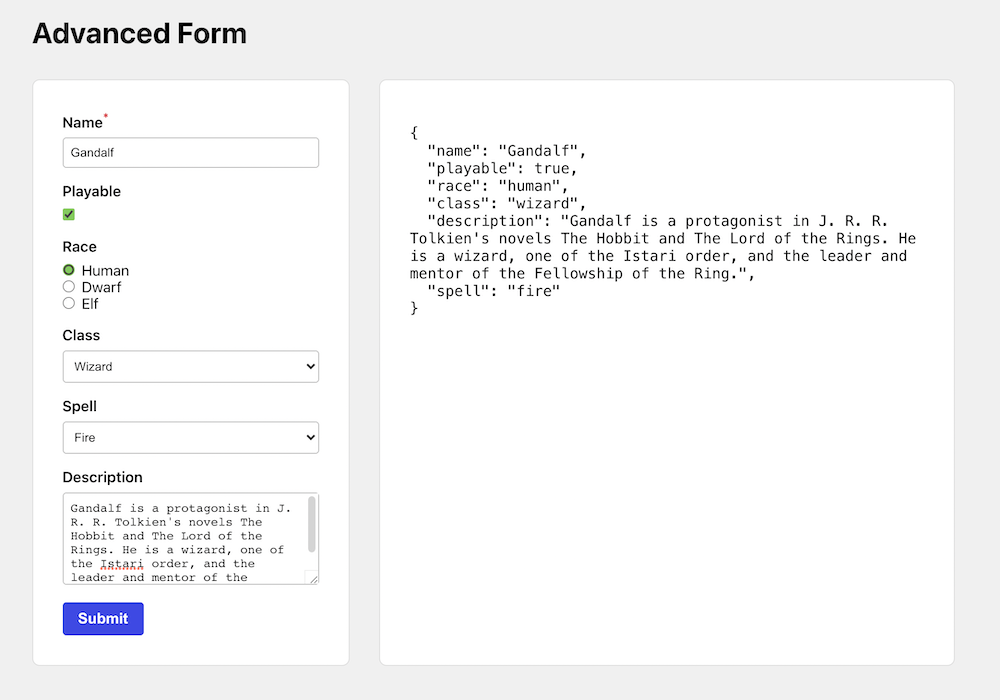

# React Advanced Form

An example of a schema-based form system in React. Define your schema, and pass it into the form. Supports basic conditional schema.



### Example

The schema system support text input, checkbox, radio group, select, textarea, and conditonal fields. It is presented in these examples with plain HTML and CSS based forms, but can easily be modified for use with any React UI framework, such as Material UI, Semantic UI, etc.

```js
const formSchema = [
  { name: 'name', label: 'Name', componentType: 'text', required: true },
  { name: 'playable', label: 'Playable', componentType: 'checkbox' },
  {
    name: 'race',
    label: 'Race',
    componentType: 'radioGroup',
    options: [
      { label: 'Human', value: 'human' },
      { label: 'Dwarf', value: 'dwarf' },
      { label: 'Elf', value: 'elf' },
    ],
  },
  {
    name: 'class',
    label: 'Class',
    componentType: 'select',
    options: [
      { label: 'Ranger', value: 'ranger' },
      { label: 'Wizard', value: 'wizard' },
      { label: 'Healer', value: 'healer' },
    ],
  },
  {
    name: 'spell',
    label: 'Spell',
    componentType: 'select',
    options: [
      { label: 'Fire', value: 'fire' },
      { label: 'Ice', value: 'ice' },
    ],
    condition: { key: 'class', value: 'wizard', operator: '=' },
  },
  {
    name: 'description',
    label: 'Description',
    componentType: 'textarea',
  },
]
```

Simply pass the schema into the component, and handle the submit event.

```jsx
<AdvancedForm schema={formSchema} onSubmit={handleSubmit} />
```
